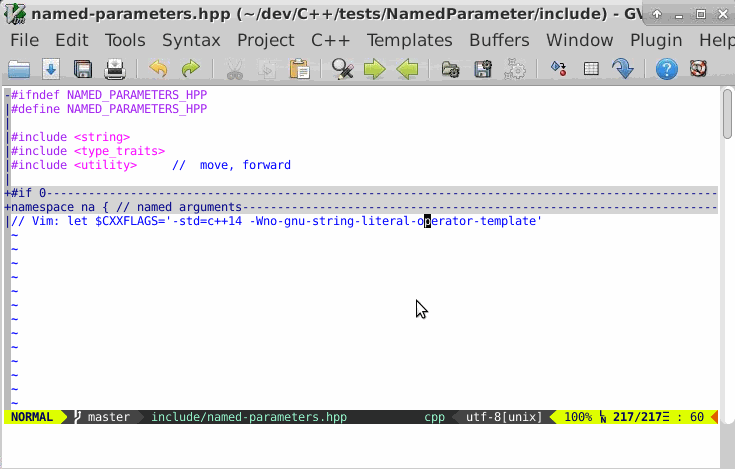

VimFold4C
=========

Reactive vim fold plugin for C &amp; C++ (and similar languages)

Unlike folding on syntax or on indent, this script tries to correctly detect
the fold boundaries.

[](https://github.com/LucHermitte/VimFold4C/releases) [](https://www.openhub.net/p/21020)

## Features

The foldtext displayed will also try to be as pertinent as possible:
- Correctly indented
- Template parameters may be discarded if they induce a foldtext line which is too long for the windows width
- Strip spaces in parenthesis, and eventually parameters when lines are too
  longs)
- Strip `scopes::` (optional)
- Multiple subsequent (consecutive ?) `#include` will be condensed into one line
- `#if` & co are folded


## Note
In order to keep the plugin reactive, I had to introduce a few hacks that
diminish the precision of the incremental algorithm used to detect fold
boundaries.  
As a consequence, sometimes lines are folded in a very strange way.  
In order to fix it, use `zx` or `zX` to reset all fold boundaries.

## Demo

Here is a little screencast to see how things are displayed with VimFold4C.



Note: the code comes from unrelated
[experiment of mine](https://github.com/LucHermitte/NamedParameter).

## Options

### How to set them (syntax)

You can set local or global options to tune the behaviour of this fold-plugin.
```vim
" In the .vimrc
let g:fold_options = {
   \ 'show_if_and_else': 1,
   \ 'strip_template_arguments': 1,
   \ 'strip_namespaces': 1,
   \ }
```
or from a [local_vimrc plugin](https://github.com/LucHermitte/local_vimrc):
```vim
let b:fold_options = {
   \ 'show_if_and_else': 1,
   \ 'strip_template_arguments': 1,
   \ 'strip_namespaces': 1,
   \ }
```

### Available options
The options are:
- `show_if_and_else` (which is currently hard-coded to _true_) requires to have
  two folds on

```c
if (foo) {
    foo_action();
} else {
    bar_action();
}
```
instead of the single fold we have when using `indent` _foldmethod_ (or was it
the `syntax` one ?).

- `strip_template_arguments` (default: _true_) strips template arguments from
  the fold text generated if the text would be too long for the current window
  width

- `strip_namespaces` (default: _true_) tells to strip scopes like `std::` or
  `boost::filesystem::` from the fold text generated.

## Requirements / Installation

This fold-plugin requires vim 7+ and
[lh-vim-lib](http://github.com/LucHermitte/lh-vim-lib).

The easiest way to install this plugin is with
[vim-addon-manager](https://github.com/MarcWeber/vim-addon-manager), or other
plugin managers based on [vim-pi](https://bitbucket.org/vimcommunity/vim-pi),
that support vim-addon-files -- as this script specifies its
[dependencies](https://github.com/LucHermitte/VimFold4C/blob/master/addon-info.txt)
in vim-addon-file format.

When installing [lh-cpp](http://github.com/LucHermitte/lh-cpp) with
[vim-addon-manager](https://github.com/MarcWeber/vim-addon-manager), or other
plugin managers based on [vim-pi](https://bitbucket.org/vimcommunity/vim-pi),
this fold-plugin will get automatically installed.
```vim
ActivateAddons lh-cpp
" Or just this one (and soon as I register it in vim-pi):
ActivateAddons VimFold4C
```

With Vundle/NeoBundle
```vim
Bundle 'LucHermitte/lh-vim-lib'
Bundle 'LucHermitte/VimFold4C'
```

So far, it is only triggered for C and C++. It should be easy to use it from
C#, Java, and other languages with C like syntax: a

```vim
runtime ftplugin/c/c-fold.vim
```

from a C#/Java/... ftplugin should do the trick.

However, I'm unlikely to handle specials cases in those languages.

## TO DO
There is still a lot to be done:

- [optional] fold a logging line spanning on several lines (`cout`, `printf`,
  `log(stuff << stuff)`
- [optional] Fold visibilities
- [optional] Merge function parameters when they induce fold lines too long to
  fit
- `#include`
  - [optional] cut the foldtext line when it's too long to fit
  - [optional] strip the dirname of each included file to build the foldtext
    line.
- Comments
  - Correctly handle comments for fold boundaries detection
  - [optional] when there is a leading comment, add a summary at the end of the
    fold text
  - [optional] support a policy for comments handling (integrated to the
    following fold, independent fold, not folded)
  - use @doxygen tags to build comments foldtext
  - File headers shall have a special treatment -> detect
    copyrights/licence/... to build the foldtext
- Tests
  - Test, Test, and re-test!
  - Test with C++11 lambdas
- Control statements
  - `switch`/`case`
    - increment foldlevel for every `case`
    - [optional] merge `case`s that aren't separated by a `break;`
  - `do { } while();` requires a specific handling
- Technicalities
  - merge all those `b:fold_*` internal variables

## History
- A long time ago (~2001), Johannes Zellner published a first folding plugin
  for C & C++.
- Then, I did some changes (2002-2004), but the result was very slow at the
  time. (the last version is still archived in
  <http://hermitte.free.fr/vim/ressources/lh-cpp.tar.gz>)
- Eventually I got tired of the slow execution times and moved back to
  foldmethod=indent.

- Here is a new (2014) version almost entirely rewritten, that I hope will
  be fast enough to be usable.
